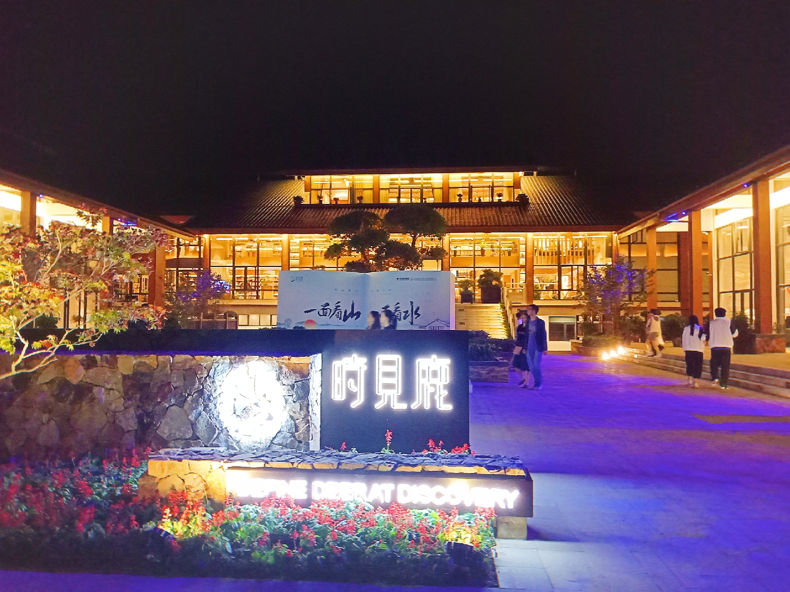

&emsp;&emsp;好多年没有写日记了，今天是10月6日，天气是如此的宜人，非常适合去森林公园游玩，但是在实验室忙碌了一天。
<!-- more -->
&emsp;&emsp;中午睡醒,无意间看到了好友刘羿的空间，他去郑州游玩，写下了篇篇游记，感触颇深。反思自己进入高中以后，是那么的功利，急于求成，忽视了自己的内心世界。

&emsp;&emsp;哎！自己的内心世界是那么的柔软，细腻，敏感，或许把每天的学习与感悟记录下来，几年后再来看，也许，我会发现这些会成为一笔伟大的精神财富。同时，我也希望在这急躁匆忙的一天给自己多几分心灵对话的机会。

&emsp;&emsp;希望自己不是一时心血来潮，能够把这件事情一直坚持下去，并且把自己每天的学习成果分享出去。

&emsp;&emsp;晚上和曹悦越好打球，没想打不小心用球把她的嘴唇弄伤了，后来我们就把球藏在了东小门旁的一棵树上，两个人一起跑到森林公园里面聊天散步去了我们一路上讲了好多关于学音乐的事，我发现，她平时不太讲话，但是一讲起来有时候还停不下来。

&emsp;&emsp;我们一路走啊走，路边的丹桂开了，虽然是晚上，但是还是能够看到金黄金黄的一片，散发着沁人心鼻的清香，同时轻柔的风轻轻拂来，甚是舒服。我们一路走到了新开的时见鹿书店，屋内灯火通明，数据琳琅满目，游客络绎不绝，好不热闹。

&emsp;&emsp;在喧嚣的闹市，可以畅谈往事，心里甚是舒服，虽然在生活中很多闲杂的事情缠身，但是在曹悦身上看到了那种无忧无虑，单纯简单的快乐，很是受感染。

